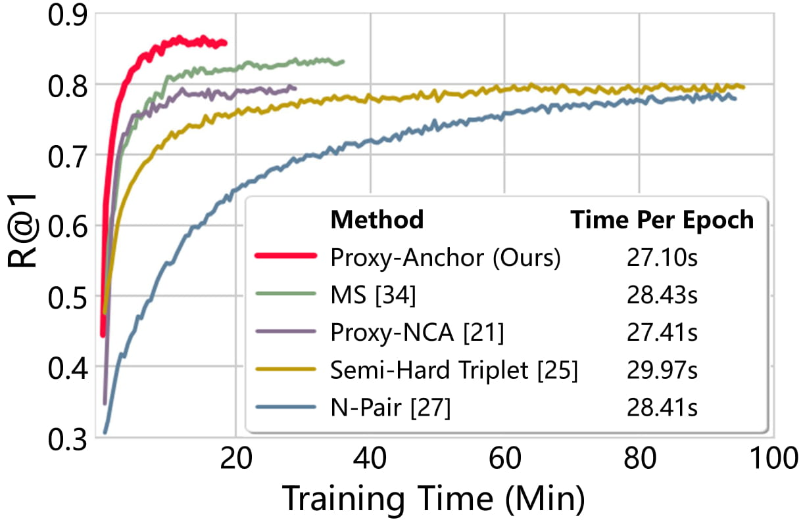

# Proxy Anchor Loss for Deep Metric Learning

Official PyTorch implementation of CVPR 2020 paper [**Proxy Anchor Loss for Deep Metric Learning**](https://arxiv.org/abs/2003.13911). 

A standard embedding network trained with **Proxy-Anchor Loss** achieves SOTA performance and most quickly converges.

This repository provides source code of experiments on four datasets (CUB-200-2011, Cars-196, Stanford Online Products and In-shop) and pretrained models.

### Accuracy in Recall@1 versus training time on the Cars-196

<p align="left"></p>


## Requirements

- Python3
- PyTorch (> 1.0)
- NumPy
- tqdm
- wandb
- [Pytorch-Metric-Learning](https://github.com/KevinMusgrave/pytorch-metric-learning)


## Datasets

1. Download four public benchmarks for deep metric learning
   - [CUB-200-2011](http://www.vision.caltech.edu/visipedia-data/CUB-200-2011/CUB_200_2011.tgz)
   - Cars-196 ([Img](http://imagenet.stanford.edu/internal/car196/car_ims.tgz), [Annotation](http://imagenet.stanford.edu/internal/car196/cars_annos.mat))
   - Stanford Online Products ([Link](https://cvgl.stanford.edu/projects/lifted_struct/))
   - In-shop Clothes Retrieval ([Link](http://mmlab.ie.cuhk.edu.hk/projects/DeepFashion.html))

2. Extract the tgz or zip file into `./data/` (Exceptionally, for Cars-196, put the files in a `./data/cars196`)

(Notice!) I found that the link that was previously uploaded for the CUB dataset was incorrect, so I corrected the link. (CUB-200 -> CUB-200-2011)
If you have previously downloaded the CUB dataset from my repository, please download it again. 
Thanks to myeongjun for reporting this issue!

## Training Embedding Network

Note that a sufficiently large batch size and good parameters resulted in better overall performance than that described in the paper. You can download the trained model through the hyperlink in the table.

### CUB-200-2011

- Train a embedding network of Inception-BN (d=512) using **Proxy-Anchor loss**

```bash
python train.py --gpu-id 0 \
                --loss Proxy_Anchor \
                --model bn_inception \
                --embedding-size 512 \
                --batch-size 180 \
                --lr 1e-4 \
                --dataset cub \
                --warm 1 \
                --bn-freeze 1 \
                --lr-decay-step 10
```

- Train a embedding network of ResNet-50 (d=512) using **Proxy-Anchor loss**

```bash
python train.py --gpu-id 0 \
                --loss Proxy_Anchor \
                --model resnet50 \
                --embedding-size 512 \
                --batch-size 120 \
                --lr 1e-4 \
                --dataset cub \
                --warm 5 \
                --bn-freeze 1 \
                --lr-decay-step 5
```

| Method | Backbone | R@1 | R@2 | R@4 | R@8 |
|:-:|:-:|:-:|:-:|:-:|:-:|
| [Proxy-Anchor<sup>512</sup>](https://drive.google.com/file/d/1twaY6S2QIR8eanjDB6PoVPlCTsn-6ZJW/view?usp=sharing) | Inception-BN | 69.1 | 78.9 | 86.1 | 91.2 |
| [Proxy-Anchor<sup>512</sup>](https://drive.google.com/file/d/1s-cRSEL2PhPFL9S7bavkrD_c59bJXL_u/view?usp=sharing) | ResNet-50 | 69.9 | 79.6 | 86.6 | 91.4 |

### Cars-196

- Train a embedding network of Inception-BN (d=512) using **Proxy-Anchor loss**

```bash
python train.py --gpu-id 0 \
                --loss Proxy_Anchor \
                --model bn_inception \
                --embedding-size 512 \
                --batch-size 180 \
                --lr 1e-4 \
                --dataset cars \
                --warm 1 \
                --bn-freeze 1 \
                --lr-decay-step 20
```

- Train a embedding network of ResNet-50 (d=512) using **Proxy-Anchor loss**

```bash
python train.py --gpu-id 0 \
                --loss Proxy_Anchor \
                --model resnet50 \
                --embedding-size 512 \
                --batch-size 120 \
                --lr 1e-4 \
                --dataset cars \
                --warm 5 \
                --bn-freeze 1 \
                --lr-decay-step 10 
```

| Method | Backbone | R@1 | R@2 | R@4 | R@8 |
|:-:|:-:|:-:|:-:|:-:|:-:|
| [Proxy-Anchor<sup>512</sup>](https://drive.google.com/file/d/1wwN4ojmOCEAOaSYQHArzJbNdJQNvo4E1/view?usp=sharing) | Inception-BN | 86.4 | 91.9 | 95.0 | 97.0 |
| [Proxy-Anchor<sup>512</sup>](https://drive.google.com/file/d/1_4P90jZcDr0xolRduNpgJ9tX9HZ1Ih7n/view?usp=sharing) | ResNet-50 | 87.7 | 92.7 | 95.5 | 97.3 |

### Stanford Online Products

- Train a embedding network of Inception-BN (d=512) using **Proxy-Anchor loss**

```bash
python train.py --gpu-id 0 \
                --loss Proxy_Anchor \
                --model bn_inception \
                --embedding-size 512 \
                --batch-size 180 \
                --lr 6e-4 \
                --dataset SOP \
                --warm 1 \
                --bn-freeze 0 \
                --lr-decay-step 20 \
                --lr-decay-gamma 0.25
```

| Method | Backbone | R@1 | R@10 | R@100 | R@1000 |
|:-:|:-:|:-:|:-:|:-:|:-:|
|[Proxy-Anchor<sup>512</sup>](https://drive.google.com/file/d/1hBdWhLP2J83JlOMRgZ4LLZY45L-9Gj2X/view?usp=sharing) | Inception-BN | 79.2 | 90.7 | 96.2 | 98.6 |

### In-Shop Clothes Retrieval

- Train a embedding network of Inception-BN (d=512) using **Proxy-Anchor loss**

```bash
python train.py --gpu-id 0 \
                --loss Proxy_Anchor \
                --model bn_inception \
                --embedding-size 512 \
                --batch-size 180 \
                --lr 6e-4 \
                --dataset Inshop \
                --warm 1 \
                --bn-freeze 0 \
                --lr-decay-step 20 \
                --lr-decay-gamma 0.25
```

| Method | Backbone | R@1 | R@10 | R@20 | R@30 | R@40 |
|:-:|:-:|:-:|:-:|:-:|:-:|:-:|
| [Proxy-Anchor<sup>512</sup>](https://drive.google.com/file/d/1VE7psay7dblDyod8di72Sv7Z2xGtUGra/view?usp=sharing) | Inception-BN | 91.9 | 98.1 | 98.7 | 99.0 | 99.1 |


## Evaluating Image Retrieval

Follow the below steps to evaluate the provided pretrained model or your trained model. 

Trained best model will be saved in the `./logs/folder_name`.

```bash
# The parameters should be changed according to the model to be evaluated.
python evaluate.py --gpu-id 0 \
                   --batch-size 120 \
                   --model bn_inception \
                   --embedding-size 512 \
                   --dataset cub \
                   --resume /set/your/model/path/best_model.pth
```


## Acknowledgements

Our code is modified and adapted on these great repositories:

- [No Fuss Distance Metric Learning using Proxies](https://github.com/dichotomies/proxy-nca)
- [PyTorch Metric learning](https://github.com/KevinMusgrave/pytorch-metric-learning)


## Other Implementations

- [Pytorch, Tensorflow and Mxnet implementations](https://github.com/geonm/proxy-anchor-loss)
- [Keras implementations](https://github.com/nixingyang/Proxy-Anchor-Loss) 
  
Thanks Geonmo and nixingyang for the good implementation :D

## Citation

If you use this method or this code in your research, please cite as:

    
    @InProceedings{Kim_2020_CVPR,
      author = {Kim, Sungyeon and Kim, Dongwon and Cho, Minsu and Kwak, Suha},
      title = {Proxy Anchor Loss for Deep Metric Learning},
      booktitle = {IEEE/CVF Conference on Computer Vision and Pattern Recognition (CVPR)},
      month = {June},
      year = {2020}
    }

